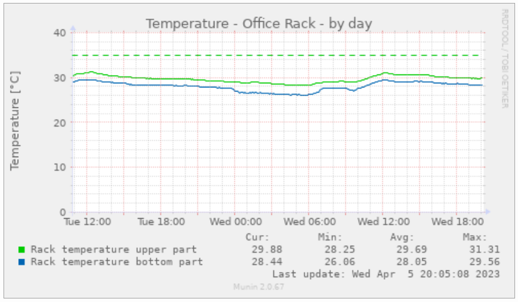

# Munin plugin for USBTEMP.com temperature sensors

This is a [Munin](http://munin-monitoring.org/) plugin for [USBTEMP.com](https://usbtemp.com/) temperture sensors. These are
DS18B20 1-wire sensors, basically attached
to a Prolific USB serial. The munin plugin code for handling the USBTEMP sensor is based on the
[usbtemp-python3](https://github.com/usbtemp/usbtemp-python3) module which was developed by Jaka. The original
code has been used to derive a Munin plugin.

Running multiple sensors in parallel is supported. Each sensor has a ROM code ID to identify the sensor.

# Install dependencies

This munin plugin requires `python3-serial`. Ot should be available via the OS package management:

```
apt install python3-serial
```

# Install plugin

To install the plugin, just put it into munin's plugin directory, usually under `/etc/munin/plugins`. Restart `munin-node`:

```
systemctl restart munin-node
```

# Configuration

You may want to make customizations in `/etc/munin/plugin-conf.d/munin-node` configuration file, for example:

```
[usbtemp]
#user root
env.usbtemp_label_287902e50c0000e0 Rack temperature upper part
env.usbtemp_label_2833afe50c000085 Rack temperature bottom part
env.usbtemp_dev_pattern /dev/ttyUSB*
```

The hexdigit-part refers to a sensor's ROM code ID. You get the available sensor IDs by running:

```
# usbtemp_dev_pattern="/dev/ttyUSB*" /etc/munin/plugins/usbtemp
temperature_287902e50c0000e0.value 23.00
temperature_2833afe50c000085.value 23.81
```

# Testing and debugging

1. Check if USB temperature sensors are attached using `lsusb` and `ls -l /dev/ttyUSB*`.

2. Run the /etc/munin/plugins/usbtemp directlywith elevated privileges.

3. Connect to `localhost:4949`, enter `list` and check the output for `usbtemp`. Enter `fetch usbtemp` and check if it works.

4. Check `munin-node`'s log files.
